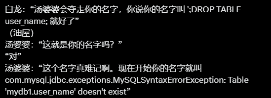

# Lightning Database

**Lightning Database** is a minimal, modular database engine designed for learning and experimentation. This project is currently in its early development stage.

---

## Project Overview

Lightning Database aims to implement a simple yet functional database system, taking inspiration from well-known systems like **MySQL**, **PostgreSQL**, and **SQLite**.

The architecture is built around a **socket-based client-server model**:

- **Frontend (Client)**: Reads user input (SQL statements), sends them to the server, displays the response, and waits for the next input.
- **Backend (Server)**: Parses and executes SQL, communicates results back to the client.

---

## Planned Features

This project is under active development. The following features are part of the design plan:

- [ ] Basic SQL parsing and validation
- [ ] Socket-based client-server interaction
- [ ] MVCC (Multi-Version Concurrency Control)
- [ ] Two isolation levels: *Read Committed* and *Repeatable Read*
- [ ] Deadlock detection and handling
- [ ] Simple table and field definitions (DDL support)
- [ ] Data durability and crash recovery

---

## Backend Module Plan

The backend will be composed of five loosely coupled modules:

| Module              | Responsibility                                      |
|---------------------|------------------------------------------------------|
| **Transaction Manager (TM)** | Manage transactions: start, commit, abort, isolation |
| **Data Manager (DM)**        | Low-level data storage and persistence        |
| **Version Manager (VM)**     | Manage multi-version data for concurrency     |
| **Index Manager (IM)**       | Provide basic indexing structures             |
| **Table Manager (TBM)**      | Table metadata and schema management          |

Each module will expose a clean interface and interact with others through abstraction.

---

## License

MIT License — feel free to fork and build on top of this idea.
